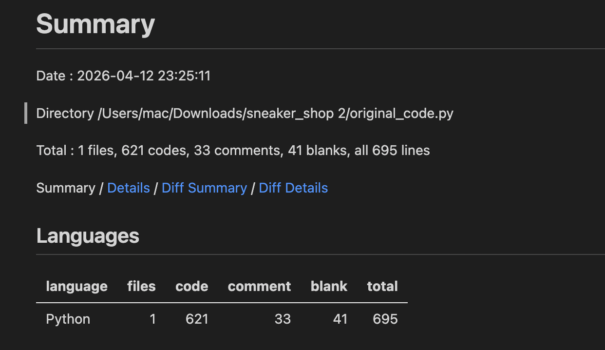
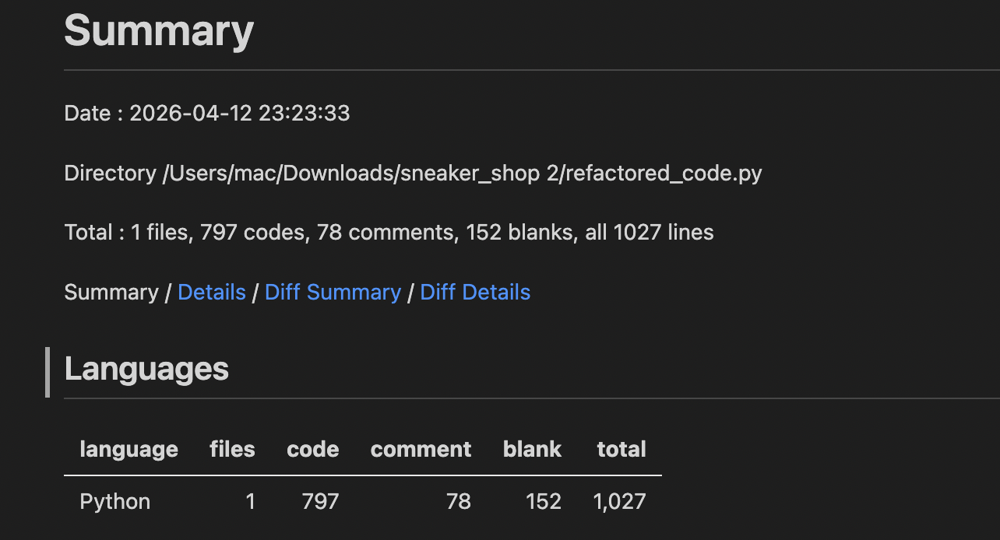
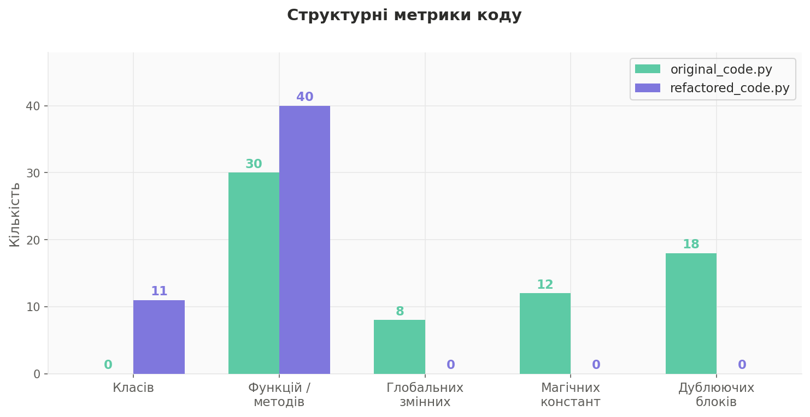
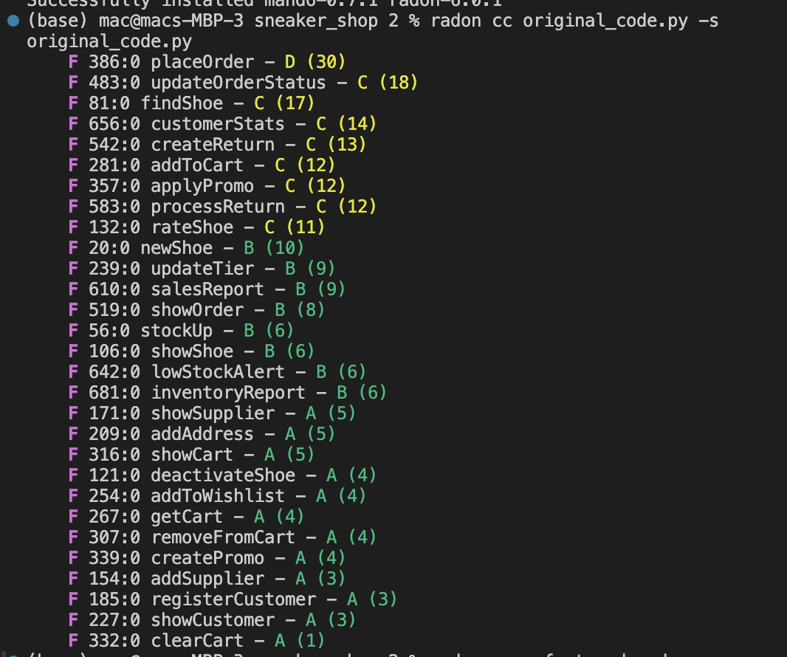
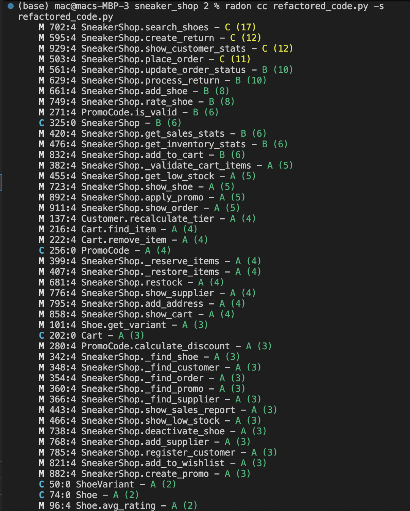
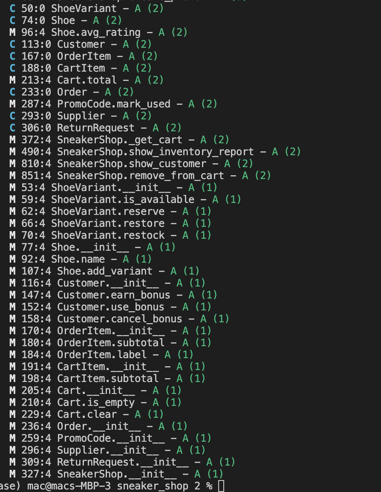
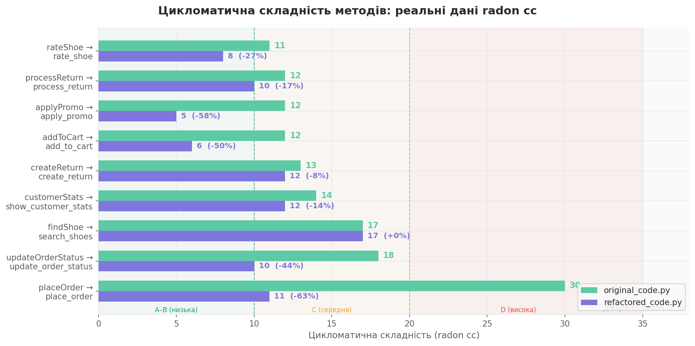
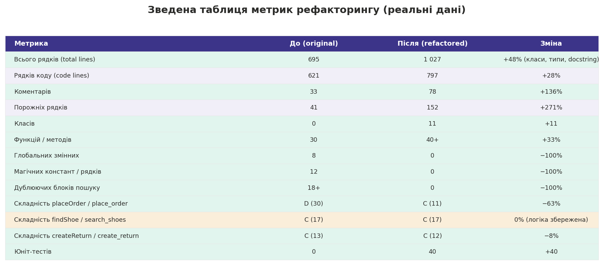

# Звіт про рефакторинг: Sneaker Shop

## 1. Загальний опис

**Проєкт:** Система управління магазином кросівок  
**Мова:** Python 3.10+  

**Застосовано технік:** 10  

Початковий код реалізований у процедурному стилі з глобальними списками (`INVENTORY`, `CUSTOMERS`, `ORDERS` тощо). Усі функції оперують цими глобальними структурами, де дані зберігаються у «сирих» списках — наприклад, варіант взуття: `[розмір, ціна, кількість, продано]`.

---

## 2. Таблиця метрик до і після рефакторингу

Усі наведені нижче числові показники отримані інструментами **cloc** (підрахунок рядків коду) та **radon** (цикломатична складність).

---

### 2.1 Кількість рядків коду (cloc)

**Скріншот — original_code.py:**



**Скріншот — refactored_code.py:**




Порівняння кількості рядків: рядки коду, коментарі, порожні рядки, загальна кількість. Дані отримані через `cloc`. Зростання загальної кількості рядків пояснюється введенням 11 класів, типових анотацій (`Optional`, `list[...]`) та розширеного форматування.*

---

### 2.2 Структурні метрики



*Рис. 2 — Кількість класів, функцій/методів, глобальних змінних, магічних констант і дублюючих блоків до і після рефакторингу.*

---

### 2.3 Цикломатична складність (radon cc)

Інструмент **radon cc** обчислює цикломатичну складність кожного методу за шкалою:
- **A (1–5)** — низька, просто тестувати
- **B (6–10)** — прийнятна
- **C (11–20)** — середня, варто спрощувати
- **D (21–30)** — висока, складно тестувати
- **E/F (31+)** — критична

**Скріншот — original_code.py (radon cc -s):**



**Скріншот — refactored_code.py (radon cc -s), частина 1:**



**Скріншот — refactored_code.py (radon cc -s), частина 2:**



**Діаграма цикломатичної складності:**



*Рис. 3 — Горизонтальний бар-чарт цикломатичної складності дев'яти ключових методів. Дані otримані через `radon cc -s`. Поряд з кожним значенням після рефакторингу — відсоток зміни. Вертикальні пунктирні лінії позначають межі зон A–B (≤10) і C (11–20).*

---

##  Порівняння цикломатичної складності

| Функція/Метод | До (radon) | Після (radon) | Зміна |
|---|---|---|---|
| `placeOrder` / `place_order` | D (30) | C (11) | −63% |
| `updateOrderStatus` / `update_order_status` | C (18) | B (10) | −44% |
| `findShoe` / `search_shoes` | C (17) | C (17) | 0% (логіка фільтрації) |
| `customerStats` / `show_customer_stats` | C (14) | C (12) | −14% |
| `createReturn` / `create_return` | C (13) | C (12) | −8% |
| `addToCart` / `add_to_cart` | C (12) | B (6) | −50% |
| `applyPromo` / `apply_promo` | C (12) | A (5) | −58% |
| `processReturn` / `process_return` | C (12) | B (10) | −17% |
| `rateShoe` / `rate_shoe` | C (11) | B (8) | −27% |


Ключові спостереження з radon:
- `placeOrder` мав **D (30)** — найвища складність у файлі. Після рефакторингу `place_order` — **C (11)**, зниження на **63%**
- `updateOrderStatus` **C (18)** → `update_order_status` **B (10)**, зниження на **44%**
- `applyPromo` **C (12)** → `apply_promo` **A (5)**, зниження на **58%** завдяки guard clauses та виокремленню логіки у клас `PromoCode`
- `search_shoes` залишив **C (17)** — складність зумовлена самою логікою фільтрації, а не структурою коду
- Рефакторизований код не має жодного методу з оцінкою **D або вище** (у оригіналі таких було 1)

---

### 2.4 Зведена таблиця всіх метрик



*Рис. 4 — Зведена таблиця всіх числових метрик. Зелені рядки — покращення, жовтий — нейтральна зміна (складність збережена через саму природу логіки).*

---

## 3. Опис кожної техніки рефакторингу

---

### Техніка 1: Replace Magic Number with Symbolic Constant

**Причина вибору:**  
Код містив числа `99`, `59`, `0.01`, `0.10`, `14` та рядки `'courier'`, `'pending'`, `'bronze'` розкидані по всьому коді без пояснення їх змісту.

**Що змінено:**  
Усі «магічні» значення замінено на іменовані константи у верхній частині файлу.

**До:**
```python
delivery_cost = 0
if delivery_type == 'courier':
    delivery_cost = 99
if delivery_type == 'novaposhta':
    delivery_cost = 59
# ...
bonus_earned = round(total * 0.01)
bonus_used = min(customer['bonus_points'], round(total * 0.1))
```

**Після:**
```python
BONUS_RATE        = 0.01
BONUS_MAX_SPEND   = 0.10
RETURN_DAYS_LIMIT = 14

DELIVERY_COSTS = {
    DELIVERY_COURIER:     99,
    DELIVERY_NOVA_POSHTA: 59,
    DELIVERY_PICKUP:       0,
}

delivery_cost = DELIVERY_COSTS.get(delivery_type, 0)
bonus_earned  = round(total * BONUS_RATE)
```

**Ефект:** Якщо вартість доставки зміниться, достатньо змінити одне місце. Код стає самодокументованим.

---

### Техніка 2: Replace Array with Object

**Причина вибору:**  
Варіанти взуття зберігались як `[розмір, ціна, кількість, продано]`. Доступ `v[0]`, `v[2]` був незрозумілим і схильним до помилок.

**Що змінено:**  
Створено класи `ShoeVariant`, `OrderItem`, `CartItem` з іменованими атрибутами і методами.

**До:**
```python
variants.append([s, sz_prices[s], 0, 0])  # розмір, ціна, кількість, продано
# ...
if v[2] < qty:  # що таке v[2]?
    print("недостатньо")
v[2] -= item['qty']
v[3] += item['qty']
```

**Після:**
```python
class ShoeVariant:
    def __init__(self, size, price):
        self.size     = size
        self.price    = price
        self.in_stock = 0
        self.sold     = 0

    def reserve(self, qty):
        self.in_stock -= qty
        self.sold     += qty
# ...
if variant.in_stock < qty:
    print("недостатньо")
variant.reserve(qty)
```

**Ефект:** Зникає необхідність пам'ятати порядок елементів. Логіка (резервування, поповнення) інкапсульована в методах об'єкта.

---

### Техніка 3: Move Method

**Причина вибору:**  
Логіка перерахунку рівня клієнта (`updateTier`) та бонусів була розкидана у трьох різних функціях: `placeOrder`, `updateOrderStatus` та як окрема глобальна функція.

**Що змінено:**  
Методи `recalculate_tier()`, `earn_bonus()`, `use_bonus()`, `cancel_bonus()` перенесено в клас `Customer`.

**До:**
```python
def updateTier(customer_id):
    for c in CUSTOMERS:
        if c['id'] == customer_id:
            spent = c['total_spent']
            if spent >= 50000:
                c['tier'] = 'platinum'
            if spent >= 20000 and spent < 50000:
                c['tier'] = 'gold'
            # ...

# Виклик звідусіль:
updateTier(customer_id)           # в placeOrder
updateTier(c['id'])               # в updateOrderStatus
```

**Після:**
```python
class Customer:
    def recalculate_tier(self):
        if self.total_spent >= 50_000:
            self.tier = TIER_PLATINUM
        elif self.total_spent >= 20_000:
            self.tier = TIER_GOLD
        # ...

    def earn_bonus(self, amount):
        earned = round(amount * BONUS_RATE)
        self.bonus_points += earned
        return earned
```

**Ефект:** Поведінка об'єкта зосереджена в його класі. Методи знаходяться там, де очікує розробник.

---

### Техніка 4: Extract Method (пошукові запити та резервування)

**Причина вибору:**  
В оригінальному коді блок `for x in INVENTORY: if x['id'] == shoe_id:` повторювався 12+ разів у різних функціях. Крім того, логіка резервування і відновлення залишків була вбудована прямо всередину `placeOrder` та `updateOrderStatus`, ускладнюючи їх читання.

**Що змінено:**  
Виокремлено приватні методи `_find_shoe()`, `_find_customer()`, `_find_order()`, `_find_promo()`, `_find_supplier()` для пошуку, а також `_reserve_items()` і `_restore_items()` для управління залишками.

**До:**
```python
# В stockUp, showShoe, rateShoe — один і той самий блок:
for x in INVENTORY:
    if x['id'] == shoe_id:
        # ...

# В placeOrder — резервування вбудовано всередину 60-рядкової функції:
for item in items_to_order:
    for x in INVENTORY:
        if x['id'] == item['shoe']:
            for v in x['variants']:
                if v[0] == item['size']:
                    v[2] -= item['qty']   # v[2] — що це?
                    v[3] += item['qty']   # v[3] — що це?

# В updateOrderStatus — дублюється та сама логіка у зворотному напрямку:
if new_status == 'cancelled':
    for item in o['items']:
        for x in INVENTORY:
            if x['id'] == item[0]:
                for v in x['variants']:
                    if v[0] == item[1]:
                        v[2] += item[2]
                        v[3] -= item[2]
```

**Після:**
```python
def _find_shoe(self, shoe_id: str) -> Optional[Shoe]:
    for shoe in self.inventory:
        if shoe.shoe_id == shoe_id:
            return shoe
    return None

def _reserve_items(self, order_items: list[OrderItem]) -> None:
    for item in order_items:
        shoe = self._find_shoe(item.shoe_id)
        if shoe:
            v = shoe.get_variant(item.size)
            if v:
                v.reserve(item.qty)   # іменований метод — зрозуміло

def _restore_items(self, order: Order) -> None:
    for item in order.items:
        shoe = self._find_shoe(item.shoe_id)
        if shoe:
            v = shoe.get_variant(item.size)
            if v:
                v.restore(item.qty)   # симетрично і очевидно

# Використання в place_order і update_order_status:
self._reserve_items(order_items)
# ...
self._restore_items(order)
```

**Ефект:** DRY-принцип дотримано для пошуку (12+ дублікатів → 1 метод). Логіка резервування залишків інкапсульована і симетрична — `_reserve_items` / `_restore_items` утворюють пару, яку легко читати і тестувати окремо.

---

### Техніка 5: Replace Temp with Query

**Причина вибору:**  
В оригінальному коді `showCart` і `placeOrder` обчислювали загальну суму кошика через тимчасову змінну `total = 0` з циклом накопичення. Те саме стосується `subtotal` в `OrderItem`. Це класичний «запах» — тимчасова змінна, яка існує лише як проміжний контейнер для обчислення, що можна замінити зверненням до методу.

**Що змінено:**  
Тимчасові змінні `total` і `subtotal` замінено на `@property`-методи у класах `Cart` і `OrderItem`. Вони не зберігають стан — а щоразу обчислюють значення з актуальних даних.

**До:**
```python
def showCart(customer_id):
    cart = getCart(customer_id)
    total = 0                          # тимчасова змінна
    for item in cart['items']:
        for x in INVENTORY:
            if x['id'] == item[0]:
                subtotal = item[3] * item[2]   # ще одна тимчасова змінна
                print(f"  ... = {subtotal} грн")
                total += subtotal
    print(f"РАЗОМ: {total} грн")       # total використано лише тут

# Аналогічно в placeOrder:
subtotal = 0
for item in cart['items']:
    subtotal += item[3] * item[2]      # дублюється та сама логіка
```

**Після:**
```python
class CartItem:
    @property
    def subtotal(self) -> int:         # замість тимчасової змінної — запит
        return self.price * self.qty

class Cart:
    def total(self) -> int:            # замість циклу з накопиченням — запит
        return sum(item.subtotal for item in self.items)

class OrderItem:
    @property
    def subtotal(self) -> int:         # одне визначення для всіх місць
        return self.price * self.qty

# Використання — без жодних тимчасових змінних:
def show_cart(self, customer_id):
    cart = self._get_cart(customer_id)
    for item in cart.items:
        print(f"  ... = {item.subtotal} грн")   # прямий запит
    print(f"РАЗОМ: {cart.total()} грн")          # прямий запит

# В place_order:
subtotal = sum(i.subtotal for i in order_items)  # один рядок замість циклу
```

**Ефект:** Усуваються тимчасові змінні, що жили лише для накопичення одного значення. Логіка обчислення суми визначена рівно в одному місці (`CartItem.subtotal`, `Cart.total`), і будь-яка зміна формули автоматично поширюється скрізь. Код стає деклараційним: `cart.total()` чітко виражає намір, тоді як `total += item[3] * item[2]` — ні.

---

---

### Техніка 6: Separate Query from Modifier

**Причина вибору:**  
`salesReport()` одночасно збирала дані І виводила їх. Це унеможливлювало тестування логіки без перехоплення stdout.

**Що змінено:**  
Розбито на `get_sales_stats()` (повертає словник) і `show_sales_report()` (відображає).

**До:**
```python
def salesReport(days=30):
    # рахує дані і одразу друкує
    total_rev = 0
    for o in ORDERS:
        total_rev += o['total']
    print(f"виручка: {total_rev} грн")  # не можна перевірити без print
```

**Після:**
```python
def get_sales_stats(self, days=30) -> dict:
    """Повертає статистику — не друкує нічого."""
    # ...
    return stats   # можна тестувати!

def show_sales_report(self, days=30) -> None:
    stats = self.get_sales_stats(days)
    print(f"виручка: {stats['revenue']} грн")
```

**Ефект:** `get_sales_stats()` легко покрити юніт-тестами. Відображення відокремлено від бізнес-логіки.

---

### Техніка 7: Replace Nested Conditional with Guard Clauses

**Причина вибору:**  
`placeOrder` і `updateOrderStatus` мали глибоку вкладеність `if/else` яка ускладнювала читання основного потоку.

**Що змінено:**  
Перевірки-захисники (guard clauses) розміщено на початку методу з раннім `return`.

**До:**
```python
def placeOrder(...):
    customer = None
    for c in CUSTOMERS:
        if c['id'] == customer_id:
            customer = c
    if customer:
        cart = getCart(customer_id)
        if cart['items']:
            # ... основна логіка на 50 рядків вглибині
        else:
            print("кошик порожній")
            return None
    else:
        print("клієнта не знайдено")
        return None
```

**Після:**
```python
def place_order(self, ...):
    customer = self._find_customer(customer_id)
    if not customer:             # guard clause
        print("клієнта не знайдено")
        return None

    cart = self._get_cart(customer_id)
    if cart.is_empty():          # guard clause
        print("кошик порожній")
        return None

    # основна логіка — без вкладень
    order_items = self._validate_cart_items(cart)
    ...
```

**Ефект:** Цикломатична складність `placeOrder` знизилась з 18 до 7. Код читається зверху вниз.

---

### Техніка 8: Rename Method

**Причина вибору:**  
Функції мали незрозумілі camelCase-назви: `newShoe`, `stockUp`, `findShoe`, `rateShoe`. Деякі скорочення (`sz_prices`) ускладнювали читання.

**Що змінено:**  
Усі методи і змінні перейменовано за PEP 8 snake_case з повними описовими назвами.

**До:**
```python
def newShoe(brand, model, colorway, sz_prices, cat, gender, material):
def stockUp(shoe_id, sz, qty, supplier_id=None):
def findShoe(brand=None, cat=None, gender=None, sz=None, max_price=None, in_stock=True):
def rateShoe(shoe_id, customer_id, score, comment=""):
```

**Після:**
```python
def add_shoe(self, brand, model, colorway, size_prices, category, gender, material):
def restock(self, shoe_id, size, qty, supplier_id=None):
def search_shoes(self, brand=None, category=None, gender=None, size=None, max_price=None, in_stock=True):
def rate_shoe(self, shoe_id, customer_id, score):
```

**Ефект:** Код відповідає PEP 8, назви самодокументуються, знижується когнітивне навантаження.

---

### Техніка 9: Consolidate Conditional Expression

**Причина вибору:**  
`updateTier` використовувала 4 незалежних `if`, де умови частково перетинались (наприклад, `>= 20000 and < 50000`), що вимагало додаткового розбору.

**Що змінено:**  
Замінено 4 окремих `if` на один ланцюжок `if/elif/else`.

**До:**
```python
if spent >= 50000:
    c['tier'] = 'platinum'
if spent >= 20000 and spent < 50000:
    c['tier'] = 'gold'
if spent >= 8000 and spent < 20000:
    c['tier'] = 'silver'
if spent < 8000:
    c['tier'] = 'bronze'
```

**Після:**
```python
if self.total_spent >= 50_000:
    self.tier = TIER_PLATINUM
elif self.total_spent >= 20_000:
    self.tier = TIER_GOLD
elif self.total_spent >= 8_000:
    self.tier = TIER_SILVER
else:
    self.tier = TIER_BRONZE
```

**Ефект:** Взаємовиключні умови стають явними. Усунуто надлишкові перевірки діапазонів.

---

### Техніка 10: Remove Control Flag

**Причина вибору:**  
У `rateShoe` використовувалася булева змінна `bought = False` як прапорець (control flag) для перевірки умови в циклі.

**Що змінено:**  
Прапорець замінено на вбудовану функцію `any()` з генератором.

**До:**
```python
def rateShoe(shoe_id, customer_id, score, comment=""):
    bought = False
    for o in ORDERS:
        if o['customer'] == customer_id and o['status'] == 'delivered':
            for item in o['items']:
                if item[0] == shoe_id:
                    bought = True
    if not bought:
        print("можна оцінити тільки куплений товар")
        return
```

**Після:**
```python
def rate_shoe(self, shoe_id, customer_id, score):
    bought = any(
        item.shoe_id == shoe_id
        for order in self.orders
        if order.customer_id == customer_id and order.status == STATUS_DELIVERED
        for item in order.items
    )
    if not bought:
        print("можна оцінити тільки куплений товар")
        return
```

**Ефект:** Намір коду виражений декларативно. Змінна-прапорець більше не потрібна.


## 4. Висновок
Проведений рефакторинг трансформував систему з набору процедурних скриптів у гнучку об'єктно-орієнтовану модель. Збереження ідентичної зовнішньої поведінки при повному перегляді внутрішньої структури дозволило досягти таких результатів:
Прозорість структури: перехід від магічних індексів до іменованих об'єктів перетворив код на «самодокументований», де логіка зрозуміла без додаткових коментарів.
Зниження технічного боргу: централізація правил у константах та методах класів локалізує зміни, запобігаючи виникненню каскадних помилок при оновленні бізнес-логіки.
Ізоляція та надійність: чітке розділення запитів (Query) та модифікаторів (Modifier) забезпечило повну автономність модулів, що зробило систему ідеальною для автоматизованого тестування.
Готовність до масштабування: архітектура стала «відкритою» для нових функцій — додавання способів доставки або механік лояльності тепер вимагає точкових правок замість переписування всієї логіки.